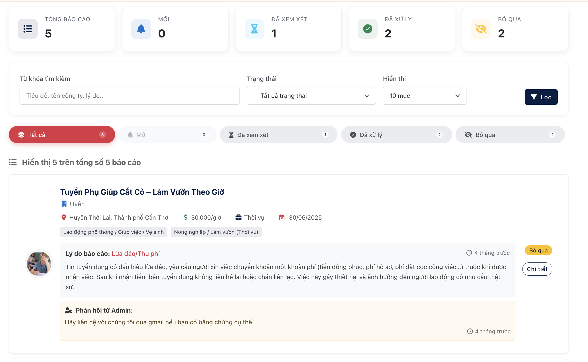

# HỆ THỐNG TÌM KIẾM VIỆC LÀM BÁN THỜI GIAN VÀ THỜI VỤ (PBL3)

[](https://docs.microsoft.com/en-us/dotnet/csharp/)
[](https://dotnet.microsoft.com/en-us/download/dotnet/8.0)
[](https://docs.microsoft.com/en-us/aspnet/core/)
[](https://www.mysql.com/)
[](https://docs.microsoft.com/en-us/ef/core/)
[](https://jquery.com/)
[](https://getbootstrap.com/)

---

Một ứng dụng web full-stack, được xây dựng trên nền tảng .NET 8 và MySQL, nhằm tạo ra một cầu nối hiệu quả giữa người tìm việc và nhà tuyển dụng trong thị trường việc làm linh hoạt (bán thời gian, thời vụ).

*[Ảnh bìa hoặc GIF demo tổng quan về ứng dụng của bạn]*

## 🌟 Tổng quan dự án

Là sản phẩm của học phần Lập trình dựa trên dự án 3 (PBL3), dự án này được xây dựng để giải quyết một thách thức thực tế: sự thiếu hụt một nền tảng tập trung, uy tín và dễ sử dụng cho thị trường việc làm linh hoạt.

Thị trường này vô cùng đa dạng, từ các bạn sinh viên đang tìm kiếm công việc đầu đời để tích lũy kinh nghiệm, cho đến những người lao động lành nghề muốn có thêm thu nhập, hay đơn giản là bất kỳ ai đang tìm kiếm sự linh hoạt trong công việc. Tuy nhiên, các nền tảng hiện tại thường rời rạc, thiếu thông tin xác thực, và chưa thực sự phục vụ tốt cho tất cả các đối tượng này. Trong khi đó, nhà tuyển dụng cũng cần một công cụ hiệu quả để tiếp cận và giao tiếp với đúng ứng viên.

Để giải quyết những thách thức trên, chúng tôi đã phát triển một ứng dụng web full-stack với mục tiêu tạo ra một sân chơi công bằng và minh bạch, nơi mọi người, **dù có kinh nghiệm hay không**, đều có thể tìm thấy cơ hội phù hợp. Nền tảng được trang bị các tính năng cốt lõi như đăng tin, tìm kiếm, quản lý hồ sơ, cùng với **hệ thống nhắn tin theo ngữ cảnh** và **hệ thống thông báo toàn diện** để xóa bỏ rào cản giao tiếp và nâng cao trải nghiệm người dùng.


---

## ✨ Các chức năng chính

### 🔍 1. Tìm kiếm & Khám phá việc làm
*   **Tìm kiếm Nâng cao:** Tìm việc làm theo từ khóa, địa điểm, ngành nghề.
*   **Bộ lọc Thông minh:** Lọc kết quả theo khoảng lương, loại hình công việc, kinh nghiệm, ca làm việc, và tin tuyển gấp.
*   **Gợi ý việc làm phù hợp:** Hệ thống tự động chấm điểm (%) độ tương thích của ứng viên với tin tuyển dụng.

    
    *Trang tìm kiếm việc làm với bộ lọc nâng cao giúp người dùng nhanh chóng tìm được công việc phù hợp.*

### 👤 2. Quản lý Hồ sơ & Ứng tuyển
*   **Hồ sơ cá nhân toàn diện:** Quản lý thông tin, CV, lịch rảnh, và khu vực làm việc mong muốn.
*   **Hệ thống ứng tuyển linh hoạt:** Cho phép nộp CV mặc định hoặc tải lên một CV mới cho từng công việc.
*   **Theo dõi & Tương tác thông minh:** Theo dõi trạng thái chi tiết của đơn ứng tuyển, rút đơn và **hoàn tác việc rút đơn**.

    
    *Giao diện quản lý các công việc đã ứng tuyển, cho phép theo dõi trạng thái và tương tác với từng đơn.*

### 🏢 3. Quản lý Tuyển dụng cho Nhà tuyển dụng
*   **Đăng & Quản lý tin tuyển dụng:** Giao diện đăng tin trực quan cùng bộ công cụ quản lý mạnh mẽ (Sửa, Xóa, Tạm ẩn, Đăng lại nhanh).
*   **Quản lý & Sàng lọc ứng viên:** Xem danh sách ứng viên theo từng tin, lọc hồ sơ, và thay đổi trạng thái (chấp nhận/từ chối).
*   **Chuyển đổi vai trò linh hoạt:** Dễ dàng chuyển đổi giữa giao diện tìm việc và tuyển dụng trên cùng một tài khoản cá nhân.

    
    *Dashboard quản lý ứng viên dành cho Nhà tuyển dụng, giúp sàng lọc và thay đổi trạng thái hồ sơ.*

### 💬 4. Hệ thống Nhắn tin theo Ngữ cảnh
*   **Trò chuyện trực tiếp:** Giao tiếp hiệu quả giữa nhà tuyển dụng và ứng viên.
*   **Ngữ cảnh hội thoại rõ ràng:** Mỗi cuộc hội thoại được gắn với một tin tuyển dụng hoặc đơn ứng tuyển cụ thể.
*   **Giao diện trực quan:** Giao diện chat quen thuộc, dễ sử dụng, hiển thị thông tin chi tiết của người liên hệ.

    
    *Hệ thống nhắn tin trực tiếp theo ngữ cảnh công việc, giúp giao tiếp giữa hai bên trở nên dễ dàng.*

### 🔔 5. Hệ thống Thông báo Tự động
*   **Thông báo tự động theo quy trình:** Tự động thông báo khi có cập nhật trạng thái ứng tuyển, tin nhắn mới, tin đăng được duyệt...
*   **Trung tâm thông báo:** Giao diện tập trung để người dùng quản lý, đánh dấu đã đọc, và xóa thông báo.
*   **Cập nhật số lượng thông báo:** Hiển thị số lượng thông báo chưa đọc trên giao diện chính.
  
    
    *Trung tâm thông báo, nơi tập trung tất cả các cập nhật quan trọng của người dùng.*

### ⚠️ 6. Hệ thống Báo cáo & Kiểm duyệt
*   **Báo cáo vi phạm từ người dùng:** Dễ dàng báo cáo các tin tuyển dụng có dấu hiệu lừa đảo, sai sự thật và theo dõi trạng thái báo cáo.
*   **Quy trình xử lý khép kín cho Admin:** Tiếp nhận, xem xét (tự động cập nhật trạng thái), và xử lý báo cáo.
*   **Phản hồi tự động hai chiều:** Gửi thông báo kết quả xử lý cho cả người báo cáo và người bị báo cáo.

    
    *Giao diện quản lý và xử lý báo cáo vi phạm của Admin, tích hợp các hành động xử lý nhanh.*

    
    *Người dùng có thể dễ dàng báo cáo vi phạm và theo dõi trạng thái xử lý.*

### 🛡️ 7. Bảng điều khiển Quản trị viên (Admin Panel)
*   **Dashboard Phân tích & Thống kê:** Biểu đồ động về sức khỏe hệ thống, có thể lọc theo tuần/tháng/năm và theo dõi KPIs chuyên sâu.
*   **Quản lý người dùng toàn diện:** Quản lý tất cả tài khoản, xác minh doanh nghiệp, thay đổi trạng thái tài khoản.
*   **Công cụ Admin mạnh mẽ:** Gửi thông báo hàng loạt đến các nhóm người dùng và **xuất dữ liệu ra file Excel**.

    
    *Bảng điều khiển trung tâm của Quản trị viên với các biểu đồ phân tích và số liệu thống kê trực quan.*
    


---

## ⚙️ Công nghệ & Kiến trúc

<details>
<summary>Xem chi tiết Công nghệ & Kiến trúc</summary>
<br>

*   **Backend:**
    *   **Ngôn ngữ & Framework:** C# trên nền tảng ASP.NET Core MVC (.NET 8.0).
    *   **Database & ORM:** MySQL 8.0+ và Entity Framework Core với provider `Pomelo.EntityFrameworkCore.MySql`.
    *   **Kiến trúc:** Thiết kế hướng dịch vụ (Service-Oriented Architecture) với các service riêng biệt cho các nghiệp vụ phức tạp (ví dụ: `IThongBaoService`).
    *   **Bảo mật:** Sử dụng ASP.NET Core Identity kết hợp Cookie Authentication để xác thực và phân quyền dựa trên vai trò (Role-Based Access Control).

*   **Frontend:**
    *   **Nền tảng:** JavaScript (ES6+), jQuery & AJAX để tạo các tương tác động.
    *   **Giao diện:** HTML5, CSS3 và Bootstrap 5 để xây dựng giao diện responsive và hiện đại.
    *   **Thư viện:** Chart.js (biểu đồ), Select2 (tìm kiếm và chọn lựa nâng cao).

*   **Quy trình & Tự động hóa:**
    *   **Phân luồng Duyệt tin:** Tin đăng của **Doanh nghiệp** phải qua `chờ duyệt`, trong khi tin của **NTD Cá nhân** được `duyệt tự động` để cân bằng giữa kiểm soát và linh hoạt.
    *   **Cập nhật trạng thái tự động:** Hệ thống tự động thay đổi trạng thái khi có tương tác mới (ví dụ: NTD xem hồ sơ, Admin xem báo cáo).
    *   **Thông báo theo Quy trình:** Mọi bước quan trọng trong quy trình nghiệp vụ (ứng tuyển, duyệt tin, xử lý báo cáo) đều được tự động hóa bằng cách gửi thông báo đến các bên liên quan.

</details>

---

## 🚦 Bắt đầu

### Yêu cầu
*   **.NET 8.0 SDK**
*   **MySQL Server** (phiên bản 8.0 hoặc cao hơn được khuyến nghị)
*   Visual Studio 2022 hoặc Visual Studio Code
*   Git

### Các bước cài đặt

1.  **Clone a Repository**
    ```sh
    git clone https://github.com/Pbl3-Group/Pbl3.git
    cd Pbl3
    ```

2.  **Thiết lập Cơ sở dữ liệu**
    *   Mở file `appsettings.json` và cập nhật chuỗi `ConnectionStrings` cho MySQL.
        ```json
        "ConnectionStrings": {
           "DefaultConnection": "Server=localhost;Database=JOBFLEX;User=YOUR_DB_USER;Password=YOUR_DB_PASSWORD;CharSet=utf8mb4;"
        }
        ```
    *   Chạy lệnh migration để tạo CSDL:
        ```sh
        Update-Database
        ```

3.  **Chạy ứng dụng**
    ```sh
    dotnet run
    ```
    *   Truy cập vào `http://localhost:5000` (hoặc cổng được chỉ định).

---

## 🔮 Cải tiến trong tương lai

Dựa trên nền tảng vững chắc đã xây dựng, đây là những tính năng thực tế và khả thi mà chúng tôi dự định phát triển trong các phiên bản tiếp theo:

*   **🔗 Tích hợp Đăng nhập Mạng xã hội (Social Login):** Cho phép người dùng đăng ký/đăng nhập nhanh qua tài khoản **Google** hoặc **Facebook**.
*   **📧 Hệ thống Gửi Email Thông báo Tự động:** Gửi email thông báo về các cập nhật quan trọng (tin nhắn mới, trạng thái ứng tuyển, việc làm phù hợp).
*   **🤖 Nâng cấp AI: Phân tích & Tự động điền Hồ sơ từ CV (CV Parsing):** Xây dựng tính năng AI "đọc" file CV và tự động điền thông tin vào hồ sơ trên web.
*   **💡 Cải tiến Hệ thống Gợi ý (Recommendation Engine):** Sử dụng Machine Learning để phân tích hành vi người dùng và đưa ra gợi ý việc làm chính xác hơn.
*   **⚡ Nâng cấp Chat & Thông báo Real-time với SignalR:** Chuyển sang kết nối thời gian thực để tin nhắn và thông báo xuất hiện ngay lập tức.
*   **⭐ Hệ thống Đánh giá Nhà tuyển dụng:** Cho phép ứng viên để lại đánh giá và xếp hạng về nhà tuyển dụng.

---

## 📄 Giấy phép

Dự án được cấp phép theo Giấy phép MIT - xem file [LICENSE](https://github.com/Pbl3-Group/Pbl3/blob/main/LICENSE) để biết chi tiết.

## ⭐ Ủng hộ dự án

Nếu bạn thấy dự án này hữu ích, hãy cân nhắc tặng nó một ngôi sao trên GitHub!

## 📞 Liên hệ

*   [@Chizk23](https://github.com/Chizk23) - Nguyễn Thanh Huyền
*   [@BichUyen2609](https://github.com/BichUyen2609) - Nguyễn Thị Bích Uyên
*   [@PhuongTran2212](https://github.com/PhuongTran2212) - Trần Thị Phượng