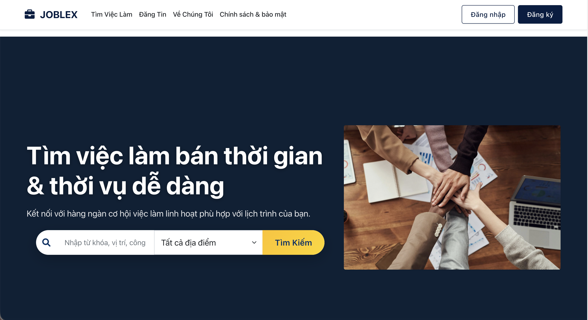

# PART-TIME AND TEMPORARY JOB SEARCH SYSTEM (PBL3)

[](https://docs.microsoft.com/en-us/dotnet/csharp/)
[](https://dotnet.microsoft.com/en-us/download/dotnet/8.0)
[](https://docs.microsoft.com/en-us/aspnet/core/)
[](https://www.mysql.com/)
[](https://docs.microsoft.com/en-us/ef/core/)
[](https://jquery.com/)
[](https://getbootstrap.com/)

---

A full-stack web application built on the .NET 8 and MySQL platform, aimed at creating an effective bridge between job seekers and employers in the dynamic market for part-time and temporary work.

[](https://youtu.be/zwJa18qtiBQ)
<p align="center"><em>Click the image above to watch an overview demo of the application.</em></p>

## 🌟 Project Overview

As a product of the Project-Based Learning 3 (PBL3) course, this project was developed to fill a significant gap in the labor market: a specialized, fast, and reliable platform for **part-time** and **temporary** jobs.

Our platform is designed to serve two primary user flows:

*   **For Job Seekers:** We cater to individuals seeking **part-time** work to balance their lifestyle or temporary jobs to **cover immediate expenses**—from students to experienced professionals.

*   **For Employers:** The platform meets the needs of two main groups:
    *   **Traditional businesses** looking for flexible staff for peak hours, events, or short-term projects.
    *   **Individual employers** seeking help with small-scale, temporary tasks.

To effectively connect these user groups, we have created a platform optimized for speed and convenience. A key feature is the ability for users to **flexibly switch between Job Seeker and Employer roles**, complemented by tools like **contextual messaging** and **automated notifications** to streamline the connection process efficiently.

---

## ✨ Core Features

<details>
<summary><b>🔍 1. Job Search & Discovery</b></summary>
<br>

*   **Advanced Search:** Find jobs by keyword, location, and industry.
*   **Smart Filters:** Filter results by salary range, job type, work shift, urgent postings, and **full-text search within experience/education requirements**.
*   **Flexible Sorting:** Sort results by posting date, salary (high/low), or application deadline.
*   **Job Matching Score:** The system automatically calculates a compatibility score (%) for candidates and job postings.

    
    <p align="center"><em>The job search page with advanced filters and sorting options.</em></p>
    
    
    <p align="center"><em>The details page provides comprehensive information about the job and the employer.</em></p>

</details>

<details>
<summary><b>👤 2. Profile & Application Management</b></summary>
<br>

*   **Comprehensive Personal Profile:** Manage personal information, default CV, availability schedule, and desired work locations.
*   **Flexible Application Process:** Apply with a default CV or **upload a new CV** tailored for a specific job.
*   **Smart Tracking & Interaction:** Track the detailed status of applications, edit information, withdraw applications, and **undo withdrawals**.

    
    <p align="center"><em>The application interface, allowing candidates to write a cover letter and select a CV.</em></p>

    
    <p align="center"><em>The interface for managing applied jobs, enabling status tracking and interaction.</em></p>

</details>

<details>
<summary><b>🏢 3. Employer Recruitment Management</b></summary>
<br>

*   **Post & Manage Job Listings:** An intuitive posting interface with powerful management tools (Edit, Delete, Quick Repost).
*   **Differentiated Approval Workflow:** Postings from **Companies** are set to "Pending Approval," while those from **Individual Employers** are "Auto-Approved."
*   **Centralized Dashboard:** Provides an overview of recruitment activities with quick statistics.

    
    <p align="center"><em>A detailed job posting form for employers.</em></p>

    
    <p align="center"><em>The main dashboard for employers with statistics and recent activities.</em></p>

*   **Applicant Management & Filtering:** View applicant lists for each posting, filter profiles, and change statuses (accepted/rejected). The system will **automatically send notifications** to candidates.

    
    <p align="center"><em>The applicant management interface for filtering and updating application statuses.</em></p>

</details>

<details>
<summary><b>💬 4. Contextual Messaging System</b></summary>
<br>

*   **Direct Chat:** Facilitates effective communication between employers and candidates.
*   **Clear Conversation Context:** Each conversation is linked to a specific job posting or application.
*   **Intuitive Interface:** A familiar, user-friendly chat interface that displays the contact's detailed information.

    
    <p align="center"><em>The direct messaging system with job-related context.</em></p>

</details>

<details>
<summary><b>🔔 5. Automated Notification System</b></summary>
<br>

*   **Workflow-based Automated Notifications:** Automatically sends alerts for application status updates, new messages, approved postings, and more.
*   **Notification Center:** A centralized interface for users to manage, mark as read, and delete notifications.
*   **Unread Count Badge:** Displays the number of unread notifications on the main interface.
  
    
    <p align="center"><em>The notification center, aggregating all important user updates.</em></p>

</details>

<details>
<summary><b>🛡️ 6. Administrator Control Panel (Admin Panel)</b></summary>
<br>

*   #### **Analytics & Reporting Dashboard**
    Dynamic charts on system health (filterable by week/month/year), in-depth KPI tracking, and an **Export Data to Excel** feature.

    
    <p align="center"><em>The central admin dashboard with analytical charts and statistics.</em></p>

*   #### **User & Content Management**
    -   **Comprehensive User Management:** View, search, filter, **create, edit**, and change the status of all user accounts.
    -   **Job Posting Moderation:** A dedicated interface to approve or reject pending job postings.
    -   **System Category Management:** Full control to add, edit, and delete core categories like Industries, Provinces/Cities, and Districts.

    
    <p align="center"><em>The interface for managing the system's core categories.</em></p>

*   #### **Report Handling & Communication System**
    -   **End-to-end Report Processing:** Receive, review, and take decisive actions: `Dismiss`, `Warn & Hide Posting`, or `Suspend Account & Hide Posting`.
    -   **Automated Feedback:** Sends notifications about the resolution to both the reporter and the reported user.
    -   **Send Campaign Notifications:** Compose and send bulk notifications to targeted user groups.

    
    <p align="center"><em>The admin interface for managing and resolving violation reports.</em></p>
    
      
    <p align="center"><em>A tool allowing admins to send campaign notifications to user groups.</em></p>

</details>

---

## ⚙️ Technology & Architecture

The project is built on a modern .NET stack, adhering to service-oriented design principles and business process automation.

*   **Backend Platform:**
    *   **Language & Framework:** C# on ASP.NET Core MVC (.NET 8.0).
    *   **Database:** MySQL 8.0+ and Entity Framework Core (using `Pomelo.EntityFrameworkCore.MySql`).
    *   **Security & Authorization:** `ASP.NET Core Identity` for Role-Based Access Control (RBAC).

*   **Frontend & Interactivity:**
    *   **Platform:** HTML5, CSS3, JavaScript (ES6+), jQuery & AJAX.
    *   **Frameworks & Libraries:** Bootstrap 5 (Responsive Design), Chart.js (Charts), Select2 (Advanced Search).

*   **Architecture & Business Logic:**
    *   **Service-Oriented Architecture (SOA):** Decouples complex business logic (e.g., `IThongBaoService`) to enhance maintainability and scalability.
    *   **Process Automation:** Automates critical workflows such as posting approvals, report handling, and contextual notifications to improve efficiency and reduce manual intervention.

---

## 🚦 Getting Started

### Prerequisites
*   **.NET 8.0 SDK**
*   **MySQL Server** (version 8.0 or higher is recommended)
*   Visual Studio 2022 or Visual Studio Code
*   Git

### Installation Steps

1.  **Clone the Repository**
    ```sh
    git clone https://github.com/Pbl3-Group/Pbl3.git
    cd Pbl3
    ```

2.  **Database Setup**
    *   Open the `appsettings.json` file and update the `ConnectionStrings` for MySQL.
        ```json
        "ConnectionStrings": {
           "DefaultConnection": "Server=localhost;Database=JOBFLEX;User=YOUR_DB_USER;Password=YOUR_DB_PASSWORD;CharSet=utf8mb4;"
        }
        ```
    *   Run the migration command to create the database:
        ```sh
        Update-Database
        ```

3.  **Run the Application**
    ```sh
    dotnet run
    ```
    *   Access the application at `http://localhost:5000` (or the specified port).

---

## 🔮 Future Improvements

Building on the solid foundation, here are practical and feasible features we plan to develop in future releases:

*   **🔗 Social Login Integration:** Allow users to quickly register/log in via their **Google** or **Facebook** accounts.
*   **📧 Automated Email Notification System:** Send email alerts for important updates (new messages, application status changes, relevant job suggestions).
*   **🤖 AI Upgrade: CV Parsing & Profile Autofill:** Develop an AI feature to "read" CV files and automatically populate the user's web profile.
*   **💡 Improved Recommendation Engine:** Use Machine Learning to analyze user behavior and provide more accurate job recommendations.
*   **⚡ Real-time Chat & Notifications with SignalR:** Upgrade to a real-time connection for instant message and notification delivery.
*   **⭐ Employer Review System:** Allow candidates to leave ratings and reviews for employers.

---

## 📄 License

This project is licensed under the MIT License - see the [LICENSE](https://github.com/Pbl3-Group/Pbl3/blob/main/LICENSE) file for details.

## ⭐ Support the Project

If you find this project useful, please consider giving it a star on GitHub!

## 📞 Contact

*   [@Chizk23](https://github.com/Chizk23) - Nguyen Thanh Huyen
*   [@BichUyen2609](https://github.com/BichUyen2609) - Nguyen Thi Bich Uyen
*   [@PhuongTran2212](https://github.com/PhuongTran2212) - Tran Thi Phuong