# HỆ THỐNG TÌM KIẾM VIỆC LÀM BÁN THỜI GIAN VÀ THỜI VỤ (PBL3)

[](https://docs.microsoft.com/en-us/dotnet/csharp/)
[](https://dotnet.microsoft.com/en-us/download/dotnet/8.0)
[](https://docs.microsoft.com/en-us/aspnet/core/)
[](https://www.mysql.com/)
[](https://docs.microsoft.com/en-us/ef/core/)
[](https://jquery.com/)
[](https://getbootstrap.com/)

---

Một ứng dụng web full-stack, được xây dựng trên nền tảng .NET 8 và MySQL, nhằm tạo ra một cầu nối hiệu quả giữa người tìm việc và nhà tuyển dụng trong thị trường việc làm linh hoạt (bán thời gian, thời vụ).

*[Ảnh bìa hoặc GIF demo tổng quan về ứng dụng của bạn]*

## 🌟 Tổng quan dự án

Là sản phẩm của học phần Lập trình dựa trên dự án 3 (PBL3), dự án này được xây dựng để giải quyết một thách thức thực tế: sự thiếu hụt một nền tảng tập trung, uy tín và dễ sử dụng cho thị trường việc làm linh hoạt.

Thị trường này vô cùng đa dạng, từ các bạn sinh viên đang tìm kiếm công việc đầu đời để tích lũy kinh nghiệm, cho đến những người lao động lành nghề muốn có thêm thu nhập, hay đơn giản là bất kỳ ai đang tìm kiếm sự linh hoạt trong công việc. Tuy nhiên, các nền tảng hiện tại thường rời rạc, thiếu thông tin xác thực, và chưa thực sự phục vụ tốt cho tất cả các đối tượng này. Trong khi đó, nhà tuyển dụng cũng cần một công cụ hiệu quả để tiếp cận và giao tiếp với đúng ứng viên.

Để giải quyết những thách thức trên, chúng tôi đã phát triển một ứng dụng web full-stack với mục tiêu tạo ra một sân chơi công bằng và minh bạch, nơi mọi người, **dù có kinh nghiệm hay không**, đều có thể tìm thấy cơ hội phù hợp. Nền tảng được trang bị các tính năng cốt lõi như đăng tin, tìm kiếm, quản lý hồ sơ, cùng với **hệ thống nhắn tin theo ngữ cảnh** và **hệ thống thông báo toàn diện** để xóa bỏ rào cản giao tiếp và nâng cao trải nghiệm người dùng.


---

## ✨ Các chức năng chính

## ✨ Các chức năng chính

<details>
<summary><b>🔍 1. Tìm kiếm & Khám phá việc làm</b></summary>
<br>

*   **Tìm kiếm Nâng cao:** Tìm việc làm theo từ khóa, địa điểm, ngành nghề.
*   **Bộ lọc Thông minh:** Lọc kết quả theo khoảng lương, loại hình, ca làm việc, tin tuyển gấp, và **tìm kiếm văn bản trong yêu cầu kinh nghiệm/học vấn**.
*   **Sắp xếp Linh hoạt:** Sắp xếp kết quả theo ngày đăng, mức lương (cao/thấp), hoặc hạn nộp hồ sơ.
*   **Gợi ý việc làm phù hợp:** Hệ thống tự động chấm điểm (%) độ tương thích của ứng viên với tin tuyển dụng.

    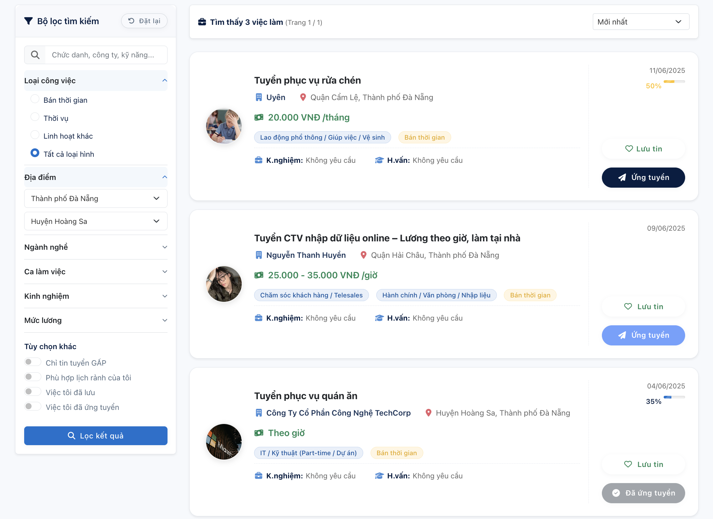
    <p align="center"><em>Trang tìm kiếm việc làm với bộ lọc nâng cao và các tùy chọn sắp xếp.</em></p>
    
    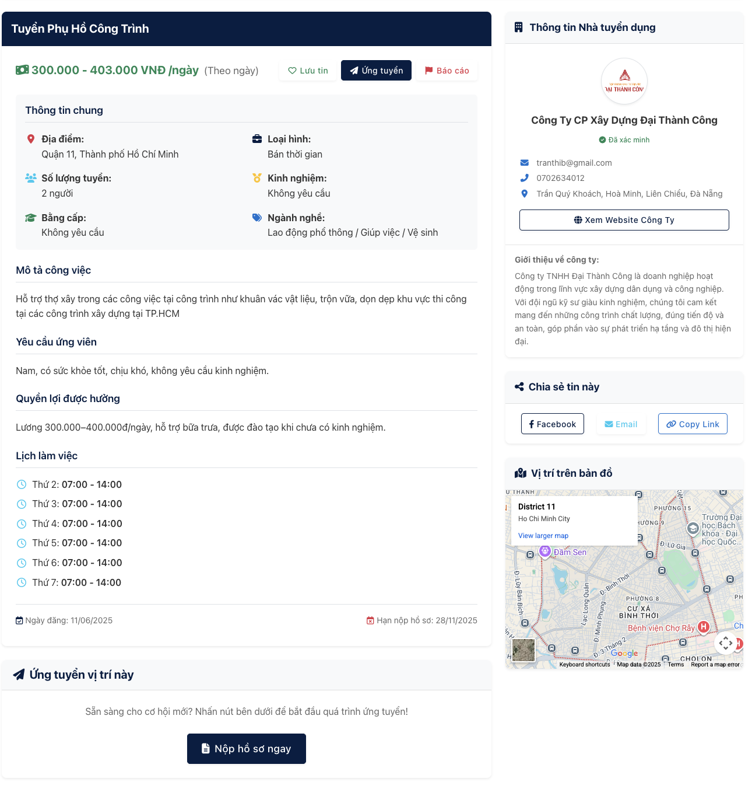
    <p align="center"><em>Trang chi tiết cung cấp đầy đủ thông tin về công việc và nhà tuyển dụng.</em></p>

</details>

<details>
<summary><b>👤 2. Quản lý Hồ sơ & Ứng tuyển</b></summary>
<br>

*   **Hồ sơ cá nhân toàn diện:** Quản lý thông tin, CV mặc định, lịch rảnh, và khu vực làm việc mong muốn.
*   **Ứng tuyển Linh hoạt:** Cho phép nộp hồ sơ với CV mặc định hoặc **tải lên một CV mới** dành riêng cho từng công việc.
*   **Theo dõi & Tương tác thông minh:** Theo dõi trạng thái chi tiết của đơn ứng tuyển, sửa đổi thông tin, rút đơn và **hoàn tác việc rút đơn**.

    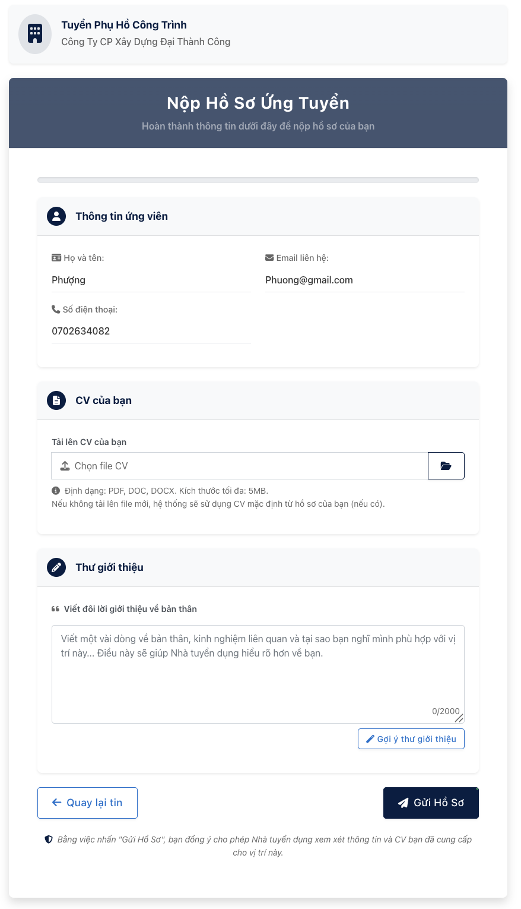
    <p align="center"><em>Giao diện nộp hồ sơ, cho phép ứng viên viết thư giới thiệu và tùy chọn CV.</em></p>

    
    <p align="center"><em>Giao diện quản lý các công việc đã ứng tuyển, cho phép theo dõi trạng thái và tương tác.</em></p>

</details>

<details>
<summary><b>🏢 3. Quản lý Tuyển dụng cho Nhà tuyển dụng</b></summary>
<br>

*   **Đăng & Quản lý tin tuyển dụng:** Giao diện đăng tin trực quan cùng bộ công cụ quản lý mạnh mẽ (Sửa, Xóa, Đăng lại nhanh).
*   **Quy trình duyệt tin phân luồng:** Tin của **Doanh nghiệp** sẽ ở trạng thái "Chờ duyệt", trong khi tin của **NTD Cá nhân** được "Duyệt tự động".
*   **Dashboard trung tâm:** Cung cấp cái nhìn tổng quan về hoạt động tuyển dụng với các số liệu thống kê nhanh.

    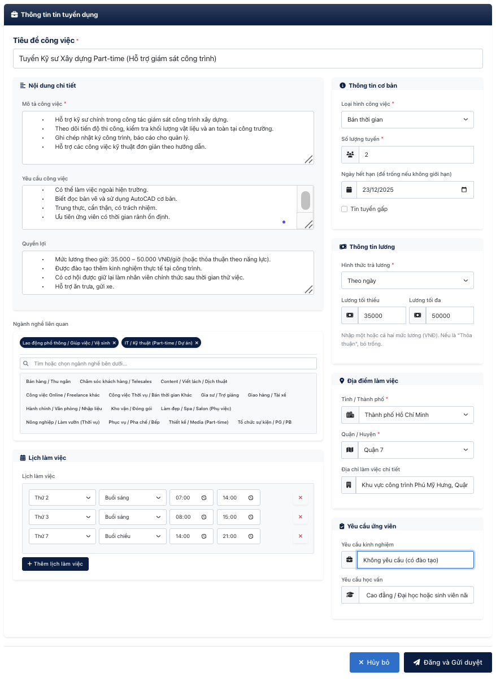
    <p align="center"><em>Form đăng tin tuyển dụng chi tiết dành cho Nhà tuyển dụng.</em></p>

    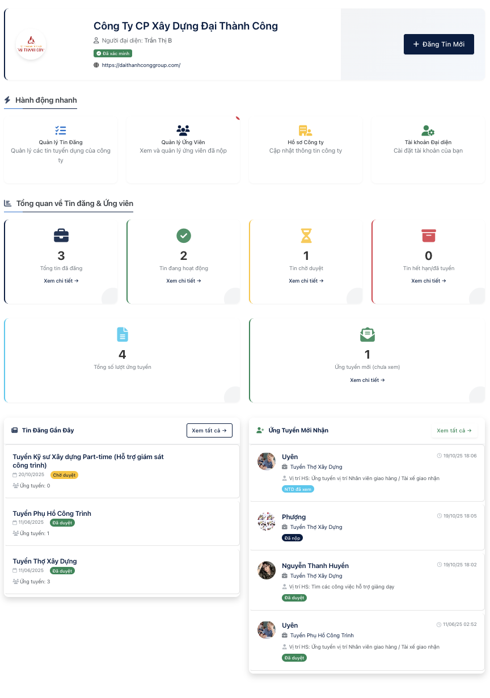
    <p align="center"><em>Dashboard chính của Nhà tuyển dụng với các thống kê và hoạt động gần đây.</em></p>

*   **Quản lý & Sàng lọc ứng viên:** Xem danh sách ứng viên theo từng tin, lọc hồ sơ, và thay đổi trạng thái (chấp nhận/từ chối). Hệ thống sẽ **tự động gửi thông báo** đến ứng viên.

    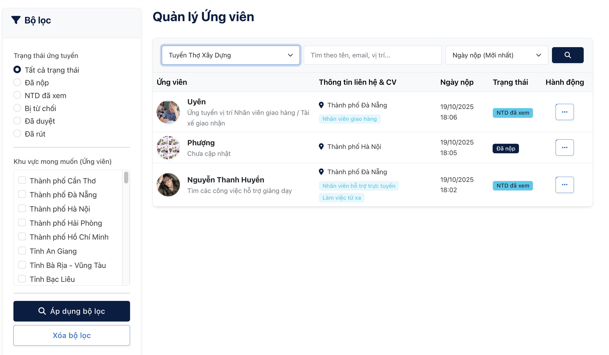
    <p align="center"><em>Giao diện quản lý ứng viên, giúp sàng lọc và thay đổi trạng thái hồ sơ.</em></p>

</details>

<details>
<summary><b>💬 4. Hệ thống Nhắn tin theo Ngữ cảnh</b></summary>
<br>

*   **Trò chuyện trực tiếp:** Giao tiếp hiệu quả giữa nhà tuyển dụng và ứng viên.
*   **Ngữ cảnh hội thoại rõ ràng:** Mỗi cuộc hội thoại được gắn với một tin tuyển dụng hoặc đơn ứng tuyển cụ thể.
*   **Giao diện trực quan:** Giao diện chat quen thuộc, dễ sử dụng, hiển thị thông tin chi tiết của người liên hệ.

    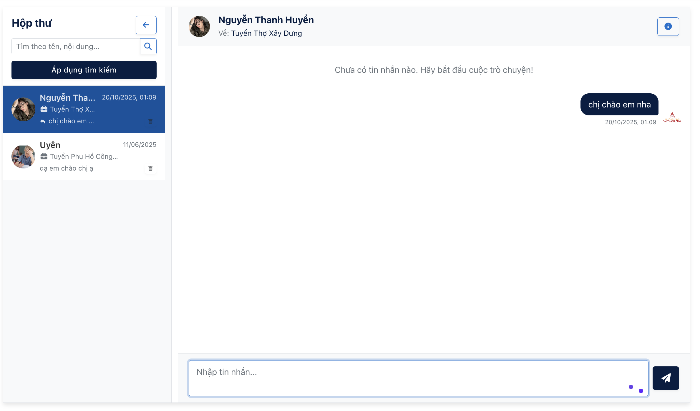
    <p align="center"><em>Hệ thống nhắn tin trực tiếp theo ngữ cảnh công việc.</em></p>

</details>

<details>
<summary><b>🔔 5. Hệ thống Thông báo Tự động</b></summary>
<br>

*   **Thông báo tự động theo quy trình:** Tự động thông báo khi có cập nhật trạng thái ứng tuyển, tin nhắn mới, tin đăng được duyệt...
*   **Trung tâm thông báo:** Giao diện tập trung để người dùng quản lý, đánh dấu đã đọc, và xóa thông báo.
*   **Cập nhật số lượng thông báo:** Hiển thị số lượng thông báo chưa đọc trên giao diện chính.
  
    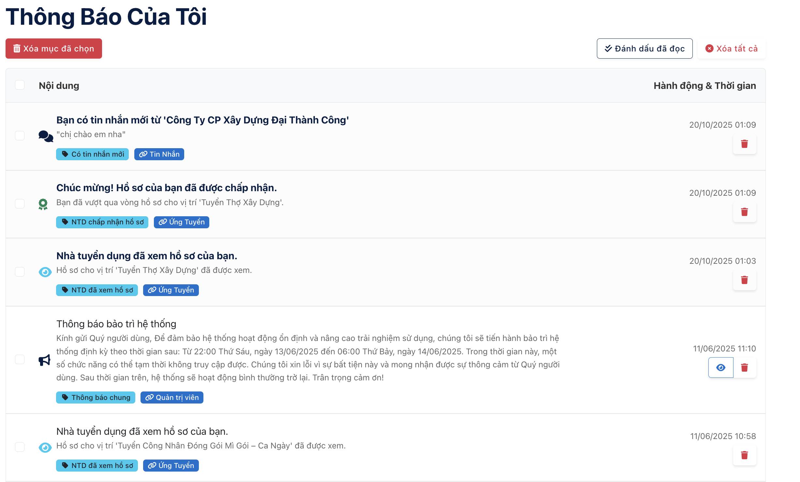
    <p align="center"><em>Trung tâm thông báo, nơi tập trung tất cả các cập nhật quan trọng của người dùng.</em></p>

</details>

<details>
<summary><b>🛡️ 6. Bảng điều khiển Quản trị viên (Admin Panel)</b></summary>
<br>

*   #### **Dashboard Phân tích & Báo cáo**
    Biểu đồ động về sức khỏe hệ thống (lọc theo tuần/tháng/năm), theo dõi KPIs chuyên sâu và tính năng **Xuất Dữ liệu ra Excel**.

    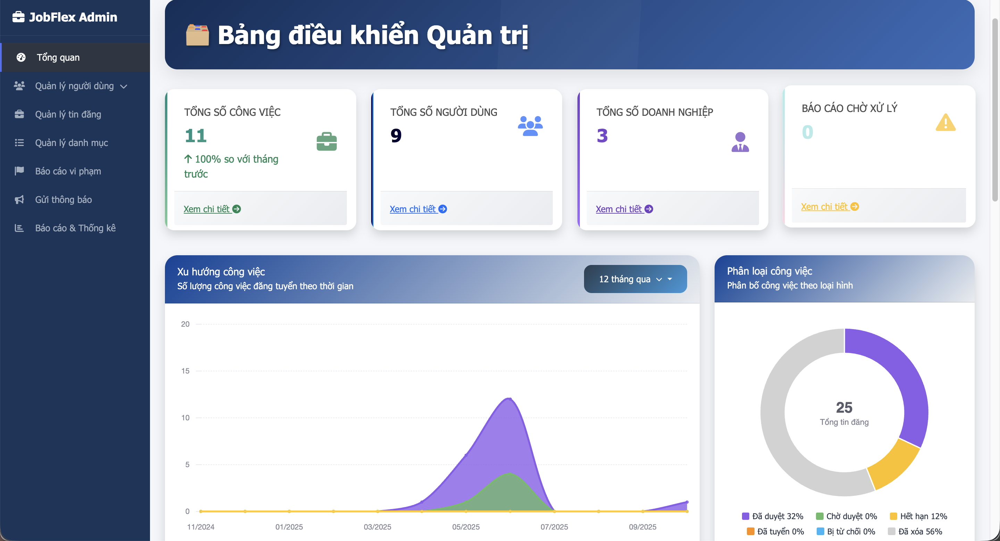
    <p align="center"><em>Bảng điều khiển trung tâm của Admin với các biểu đồ phân tích và số liệu thống kê.</em></p>

*   #### **Quản lý Người dùng & Nội dung**
    -   **Quản lý người dùng toàn diện:** Xem, tìm kiếm, lọc, **tạo mới, chỉnh sửa**, và thay đổi trạng thái của tất cả tài khoản.
    -   **Kiểm duyệt tin đăng:** Giao diện chuyên biệt để duyệt hoặc từ chối các tin đăng đang chờ.
    -   **Quản lý Danh mục Hệ thống:** Toàn quyền thêm, sửa, xóa các danh mục cốt lõi như Ngành nghề, Tỉnh/Thành, Quận/Huyện.

    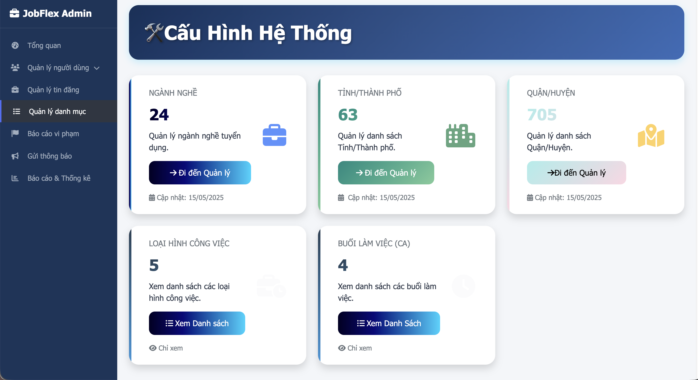
    <p align="center"><em>Giao diện quản lý các danh mục cốt lõi của hệ thống.</em></p>

*   #### **Hệ thống Xử lý Báo cáo & Giao tiếp**
    -   **Quy trình xử lý báo cáo khép kín:** Tiếp nhận, xem xét, và đưa ra các hành động xử lý mạnh mẽ: `Bỏ qua`, `Cảnh cáo & Ẩn tin`, hoặc `Đình chỉ tài khoản & Ẩn tin`.
    -   **Phản hồi tự động:** Gửi thông báo kết quả xử lý cho cả người báo cáo và người bị báo cáo.
    -   **Gửi Thông báo Chiến dịch (Campaigns):** Soạn và gửi thông báo hàng loạt đến các nhóm người dùng được nhắm mục tiêu.

    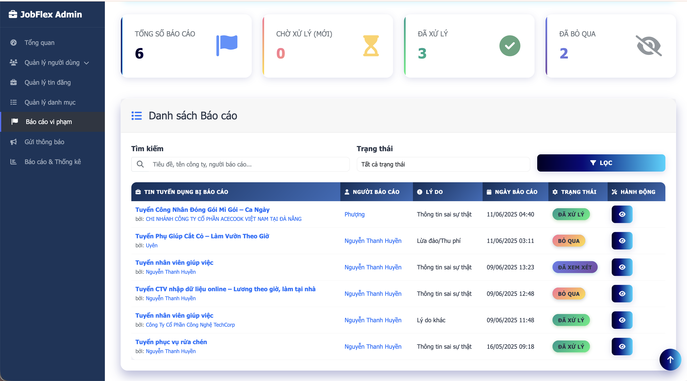
    <p align="center"><em>Giao diện quản lý và xử lý báo cáo vi phạm của Admin.</em></p>
    
      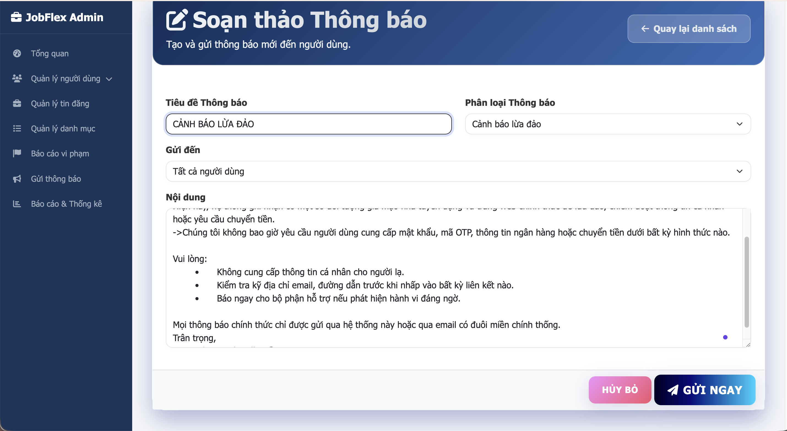
    <p align="center"><em>Công cụ cho phép Admin gửi thông báo chiến dịch đến các nhóm người dùng.</em></p>

</details>

---

## ⚙️ Công nghệ & Kiến trúc

Dự án được xây dựng trên nền tảng .NET hiện đại, tuân thủ các nguyên tắc thiết kế hướng dịch vụ và tự động hóa quy trình nghiệp vụ.

*   **Nền tảng Backend:**
    *   **Ngôn ngữ & Framework:** C# trên nền tảng ASP.NET Core MVC (.NET 8.0).
    *   **Cơ sở dữ liệu:** MySQL 8.0+ và Entity Framework Core (sử dụng `Pomelo.EntityFrameworkCore.MySql`).
    *   **Bảo mật & Phân quyền:** `ASP.NET Core Identity` để quản lý vai trò và quyền truy cập (Role-Based Access Control).

*   **Giao diện & Tương tác:**
    *   **Nền tảng:** HTML5, CSS3, JavaScript (ES6+), jQuery & AJAX.
    *   **Framework & Thư viện:** Bootstrap 5 (Responsive Design), Chart.js (Biểu đồ), Select2 (Tìm kiếm nâng cao).

*   **Kiến trúc & Quy trình nghiệp vụ:**
    *   **Kiến trúc hướng dịch vụ (SOA):** Tách biệt các nghiệp vụ phức tạp (ví dụ: `IThongBaoService`) giúp mã nguồn dễ bảo trì và mở rộng.
    *   **Tự động hóa Quy trình:** Tự động hóa các luồng nghiệp vụ quan trọng như duyệt tin, xử lý báo cáo, và gửi thông báo theo ngữ cảnh để tăng hiệu quả và giảm thiểu thao tác thủ công.

---

## 🚦 Bắt đầu

### Yêu cầu
*   **.NET 8.0 SDK**
*   **MySQL Server** (phiên bản 8.0 hoặc cao hơn được khuyến nghị)
*   Visual Studio 2022 hoặc Visual Studio Code
*   Git

### Các bước cài đặt

1.  **Clone a Repository**
    ```sh
    git clone https://github.com/Pbl3-Group/Pbl3.git
    cd Pbl3
    ```

2.  **Thiết lập Cơ sở dữ liệu**
    *   Mở file `appsettings.json` và cập nhật chuỗi `ConnectionStrings` cho MySQL.
        ```json
        "ConnectionStrings": {
           "DefaultConnection": "Server=localhost;Database=JOBFLEX;User=YOUR_DB_USER;Password=YOUR_DB_PASSWORD;CharSet=utf8mb4;"
        }
        ```
    *   Chạy lệnh migration để tạo CSDL:
        ```sh
        Update-Database
        ```

3.  **Chạy ứng dụng**
    ```sh
    dotnet run
    ```
    *   Truy cập vào `http://localhost:5000` (hoặc cổng được chỉ định).

---

## 🔮 Cải tiến trong tương lai

Dựa trên nền tảng vững chắc đã xây dựng, đây là những tính năng thực tế và khả thi mà chúng tôi dự định phát triển trong các phiên bản tiếp theo:

*   **🔗 Tích hợp Đăng nhập Mạng xã hội (Social Login):** Cho phép người dùng đăng ký/đăng nhập nhanh qua tài khoản **Google** hoặc **Facebook**.
*   **📧 Hệ thống Gửi Email Thông báo Tự động:** Gửi email thông báo về các cập nhật quan trọng (tin nhắn mới, trạng thái ứng tuyển, việc làm phù hợp).
*   **🤖 Nâng cấp AI: Phân tích & Tự động điền Hồ sơ từ CV (CV Parsing):** Xây dựng tính năng AI "đọc" file CV và tự động điền thông tin vào hồ sơ trên web.
*   **💡 Cải tiến Hệ thống Gợi ý (Recommendation Engine):** Sử dụng Machine Learning để phân tích hành vi người dùng và đưa ra gợi ý việc làm chính xác hơn.
*   **⚡ Nâng cấp Chat & Thông báo Real-time với SignalR:** Chuyển sang kết nối thời gian thực để tin nhắn và thông báo xuất hiện ngay lập tức.
*   **⭐ Hệ thống Đánh giá Nhà tuyển dụng:** Cho phép ứng viên để lại đánh giá và xếp hạng về nhà tuyển dụng.

---

## 📄 Giấy phép

Dự án được cấp phép theo Giấy phép MIT - xem file [LICENSE](https://github.com/Pbl3-Group/Pbl3/blob/main/LICENSE) để biết chi tiết.

## ⭐ Ủng hộ dự án

Nếu bạn thấy dự án này hữu ích, hãy cân nhắc tặng nó một ngôi sao trên GitHub!

## 📞 Liên hệ

*   [@Chizk23](https://github.com/Chizk23) - Nguyễn Thanh Huyền
*   [@BichUyen2609](https://github.com/BichUyen2609) - Nguyễn Thị Bích Uyên
*   [@PhuongTran2212](https://github.com/PhuongTran2212) - Trần Thị Phượng